## Table of contents :

> 
> 
> - Overview
> - Project Structure
> - System Architecture
> - Algorithms Benchmark
> - Successful Scenarios (dynamic register, health check, rate limiting demos)
> - Conclusion
> - How to Run

---

## Overview :

> The project is a small sized **Load-Balancer(LB)** that implements load-balancing algorithms like **Round** **Robin (RR) , Weighted Round Robin(WRR) , Random LoadBalancing(RLB) , Least Connection(LC) and Source IP Hashing(SIPH)** , Distributing the load over a 5 nodes containerized system with **Rate limiting , Health checking** and **Dynamic node registration** features
> 

---

## Project Structure :

- **Algorithms layer (/algorithms/algorithms.go) :** that has the implementation of the five algorithms mentioned before as functions that returns a node id according to the algorithm called used in the **(/load_balancer/lb.go)** in lbHandler function there
- **Load-Balancer :**
    - **(/load_balancer/lb.go) :** has the main load balancer logging prints and logic like :
        - **`/register`** endpoint that allow nodes register dynamically on startup rather than being hardcoded, which allows the system to scale without redeployment. The mutex ensures thread safety since multiple nodes may register simultaneously during cluster startup , it takes node’s {id, url,weight} to register node to the load balancer cluster  (**nodes_map** and **active nodes** slice if it is healthy ) and eventually updating algorithms that requires the **active_nodes** state like RR and WRR that requires active nodes current count and their weights
        - `/` root endpoint which is the main endpoint to the lb that is used to route the incoming requests to the cluster by checking if there is available and healthy nodes , check the limit for the client ip then match the algorithm id and apply it to get the node id to pass it the reverse proxy to forward it to the required node and return the response to the client when the node finishes  , The reverse proxy pattern is used so clients only interact with the load balancer's address, keeping the node topology transparent to the client, Go's `net/http` package automatically handles each incoming request in its own goroutine, enabling true concurrent request processing and all read and write operations are protected against race conditions through mutex locks
        - **StartServer** function that starts the lb and declare the endpoints handlers and starts the health checker in a goroutine and listens to the port 8080 for incoming connections
    - **(/load_balancer/health_checker.go) :**  it checks for healthy nodes repeatedly by running a background goroutine every 5 seconds through time ticker to nodes `/healthy` endpoint so it removes the failed ones from **active_nodes** slice ****for the lb algorithms to distribute the load among only the current healthy nodes  **and the** worst case scenario to detect a failed node will take about **7 seconds** ( 5 seconds till the next health checker plus 2 seconds timeout for the node to send its response or its marked unhealthy ) , When a failed node restarts, it automatically re-registers with the load balancer through the `/register` endpoint, adding itself back to the active pool without any manual intervention
    - **(/load_balancer/rate_limiter.go) :** The rate limiter implements the **token bucket algorithm** to protect the system from traffic bursts and abuse. Each client IP has its own bucket with a maximum capacity of 10,000 (could be adjusted) tokens, refilling at 10,000 tokens per second. When a request arrives, the elapsed time since the last refill is calculated and tokens are added proportionally capped at the maximum capacity. If at least one token is available, it is consumed and the request is allowed. Otherwise the request is rejected with a 429 Too Many Requests response.
    Token bucket was chosen over simpler approaches like fixed window counting because it handles burst traffic gracefully — a client can burst up to the bucket capacity instantly, then is throttled to the refill rate sustainably. This prevents a single client from overwhelming the system while still allowing legitimate traffic spikes.
- **Node (/node/node.go) :** this is the node backend server it only has 2 main endpoints one is the `/healthy`  which just responds with **200 ok** for health checking and the  `/calc` endpoint receives a parameter `n` and computes the mathematical function H(n), which iterates `n × 10⁶` times performing floating point operations (square root, sine, logarithm) per iteration. This deliberately CPU-intensive computation simulates real-world heavy workloads, making it suitable for benchmarking how effectively the load balancer distributes computational load across nodes
- **Model (/models/models.go) :** has **Node** struct that carries node data { id, url,weight,connections count , healthy flag } used as type for **active_nodes** slice
and **RegisterRequest** struct to decode the json coming from node’s register request has node’s data { id , url , weight }
- **CMD :**
    - **(cmd/lb/main.go) :**  the entry point just starts the LB server by calling StartServer() function
    - **(cmd/node/main.go) :** the entry point for the node server that generates a random weight number in range `[0,10)+1`  and collects the data { hostname (id) , url (hostname:port), weight } and then sends request on `/register`  to register itself to the cluster in a retry loop in case of a failure ,  then starts its server

---

## System Architecture :

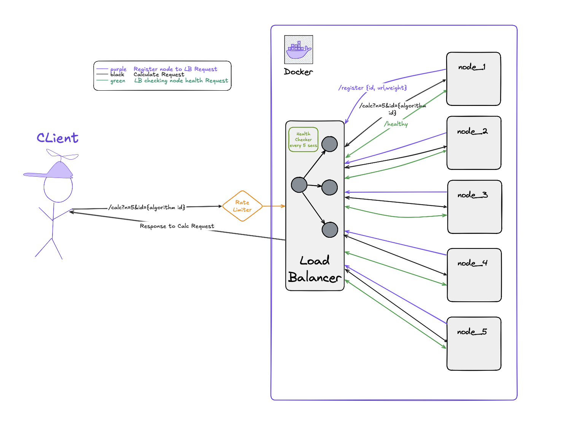

the client sends the calc request to the system on LB ip , first the rate limiter checks if client ip has enough tokens to accept that request , if not it responds with **429** Too Many Requests 
then according to algorithm id in the request it uses the required algorithm to route the request to the returned node id from the chosen algorithm via a reverse proxy pattern which ensures the system is transparent to the client , a direct response from the node would come from a different IP address than the one the client originally connected to, breaking the TCP connection

the system checks the health of nodes every 5 seconds and remove failed nodes from the **active_nodes so the** algorithms get adjusted to the current healthy nodes count and distribute the work evenly  

****on start up of the system nodes register themselves dynamically to the LB cluster which allows scalability without the need of the getting the system down and add more nodes manually also useful as nodes gets crashed they can also register dynamically without any downtime for the whole system 
****

---

## Algorithms Benchmark :

### Benchmark command :

`ab -n 10000 -c 200 "[http://localhost:8080/calc?n=5&id=](http://localhost:8080/calc?n=5&id=5){algo_id}"` 

with **10000 request** and **200 concurrent** ones 

- **RoundRobin** works by assigning the workload blindly to each node one after another in circular matter and doesn’t care that a node might be busy and others are idle only care about who's turn is now  . It is best used when workload is predictable and takes same amount of time for every request . In our benchmark it achieved **125.44** req/sec ,which was the fastest algorithm but when the workload got heavy the response time got slower with noticeably great standard deviation from the average response time .
- **WeightedRoundRobin** works Like Round robin but every node has a weight so the algorithm assign the request to same node until it is done with its weight and then move to the next node in turn . It is best used when nodes have different hardware capabilities or resource capacities a more powerful node gets a higher weight and receives proportionally more requests. In our benchmark it achieved **116.66** req/sec with the highest variance of all algorithms, because uneven weight distribution can overload heavier-weighted nodes under burst traffic.
- **Random LoadBalancing** works by randomly assigning requests to nodes . It is best used when It is best used when simplicity is preferred and no state tracking is needed it requires no counters or connection tracking, making it the simplest stateless algorithm. In our benchmark it achieved **112.45** req/sec performing between Round Robin and Least Connections in consistency.
- **Least Connection** works by choosing the node with least client connections and assign the request to it and increment the connection count dynamically and when node finishes it decrement the count . It is best used when workload is dynamic and every request takes different time to be processed . In our benchmark it achieved **106.95** req/sec with which is slower than round robin but more consistent when workload is heavy with good user experience of a response time
- **Source IP Hashing** works by hashing the client ip via hashing function and using modulus operation `%` on nodes count in the cluster to get the same node id every time the same client requests a session . It is best used when needing the client to be served with the same server every time he requests called sticky session . In our benchmark it achieved **97.98** req/sec and it is the slowest of them all because in the benchmark it overloaded only one node with work due to requesting 10000 request with same client ip

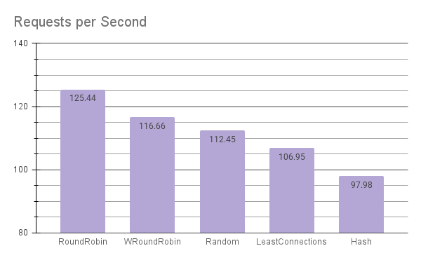

Round Robin achieved the highest throughput at 125.44 req/sec, with performance decreasing as algorithm complexity increases. Source IP Hashing scored lowest at 97.98 req/sec due to routing all benchmark requests from the same IP to a single node, overloading it while others remained idle

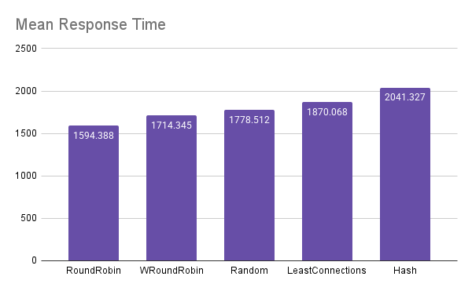

Mean response time inversely mirrors the throughput results Round Robin had the lowest average wait time at 1594ms while Hash had the highest at 2041ms. Lower mean time directly correlates with higher throughput as the system processes requests faster.

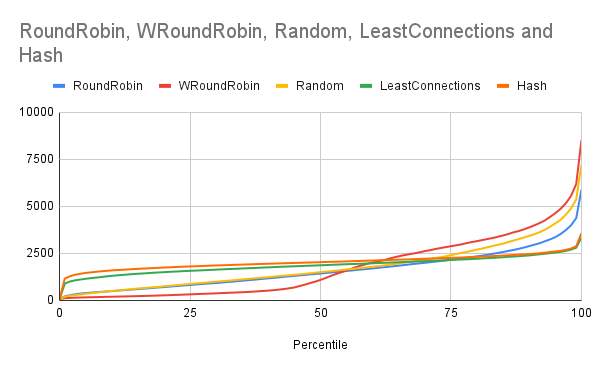

This chart reveals the most important insight of the benchmark how each algorithm behaves under increasing load. LeastConnections and Hash maintain flat, consistent curves until the 75th percentile, while WRoundRobin spikes dramatically at the 90th+ percentile reaching 8526ms for the worst requests. Round Robin shows high variance with a steep tail, confirming that despite its throughput advantage, some requests experience significantly longer wait times under heavy concurrent load. This demonstrates that fastest average throughput does not always mean best user experience

---

## Successful Scenarios (dynamic register, health check, rate limiting demos):

- **Dynamic Register :** nodes keep retry requesting to the LB until it receives response from it when it is up and ready for nodes registering
    
    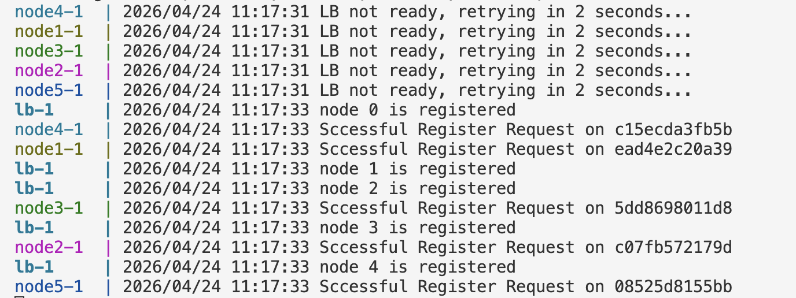
    
- **Rate Limiting :** the token bucket was configured with a maximum of 10 tokens. Running 15 requests with 11 concurrent, exactly 5 requests were rejected with 429 Too Many Requests — the first 10 consumed all available tokens, and the remaining 5 found an empty bucket and were rejected. This confirms the token bucket algorithm correctly enforces the configured limit

    **ab command output :**
    
    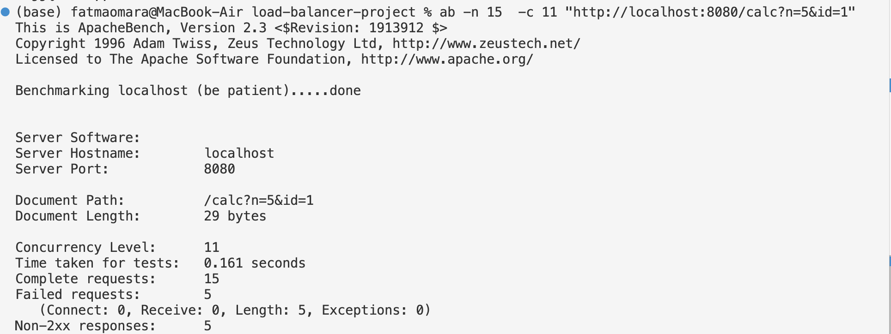
    
    **LB output :** this output shows the 5 rejected request due to the rate limit and that every node process exactly 2 requests as a result of applying the **Round Robin** algorithm 
    
    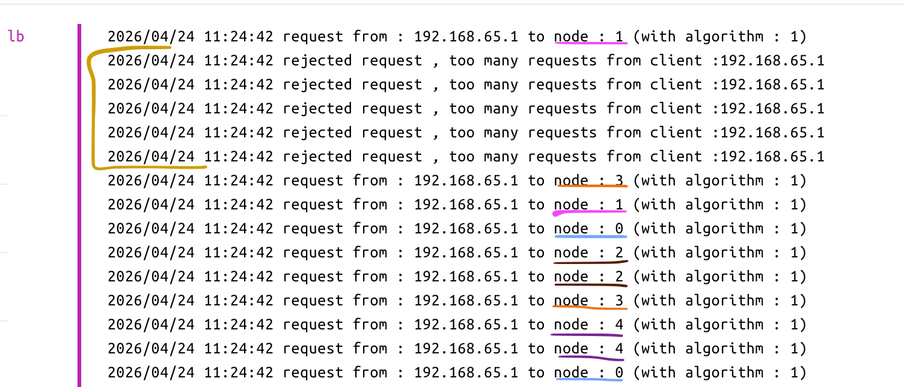
    

- **Health Checking :** we will kill nodes 3 and see what happens
    
    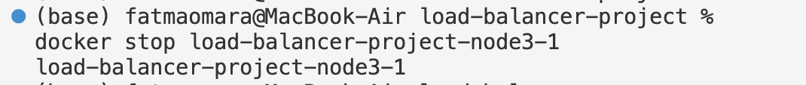
    
    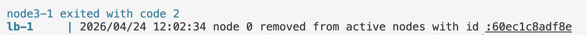
    
    LB removed it from active_nodes slice and then we make another 15 request with 11 concurrent ones and max token count 10 and RR applied , and as we see load is distributed over the remaining 4 nodes , nodes 0 and 1 taking 3 requests , nodes 2 and 3 taking 2 requests making a 10 successful requests 
    
    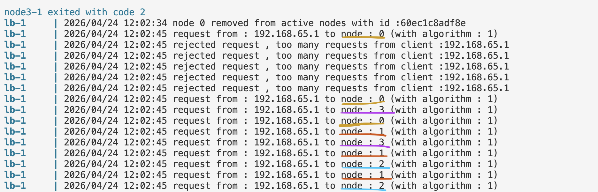
    
    now lets restart the dead node
    
    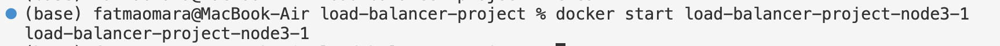
    
    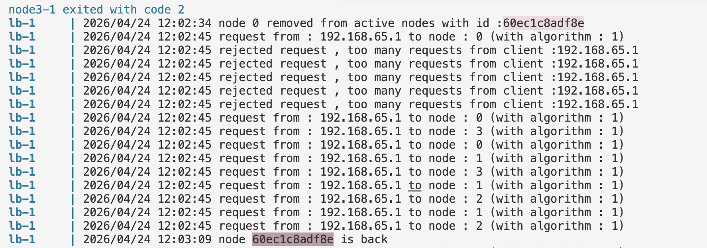
    
    noticing that the LB marked it as healthy and added it back to the **active_nodes** slice and it has the same id **60ec1c** and work is distributed over 5 nodes 2 request for each one for RR algorithm
    
    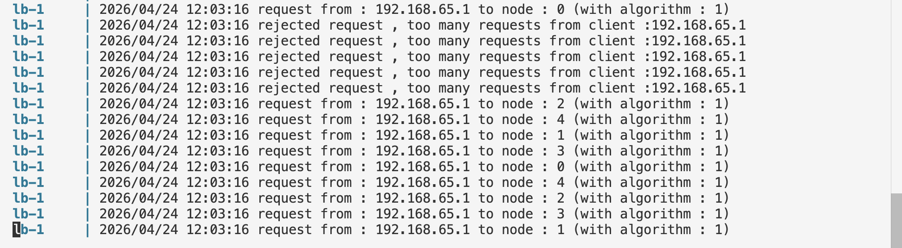
    

---

## Conclusion

This project successfully implemented a load balancer in Go supporting 5 algorithms, containerized with Docker, with health checking, rate limiting and dynamic node registration. Benchmarks showed Round Robin achieved the highest throughput at 125.44 req/sec while Least Connections showed the most consistent response times with the lowest standard deviation

Future improvements would include a separate control plane service for secure node management, RWMutex for better read concurrency, and a real-time dashboard for monitoring traffic distribution

---
 ## Requirements
- Docker & Docker Compose
- Apache Bench (for benchmarking)

## How to Run

```bash
# Clone the repository
git clone https://github.com/ftomara/load-balancer-project.git
cd load-balancer-project

# Start the system (LB + 5 nodes)
docker-compose up --build
```

The nodes will automatically register with the load balancer on startup.

## Algorithm IDs

| ID | Algorithm | Best Used When |
|---|---|---|
| 1 | Round Robin | Uniform workloads, simplicity preferred |
| 2 | Weighted Round Robin | Nodes have different hardware capabilities |
| 3 | Random | Stateless, no tracking needed |
| 4 | Least Connections | Dynamic workloads, variable request duration |
| 5 | Source IP Hashing | Session affinity (sticky sessions) required |

## Benchmark

```bash
# Run benchmark against specific algorithm
ab -n 10000 -c 200 "http://localhost:8080/calc?n=5&id={algo_id}"

# Run all algorithms automatically
bash stress_test.sh
```

## Health Check Testing

```bash
# Kill a node
docker stop load-balancer-project-node3-1

# LB detects failure within 7 seconds and removes from rotation

# Restart node — auto-registers back
docker start load-balancer-project-node3-1
```
